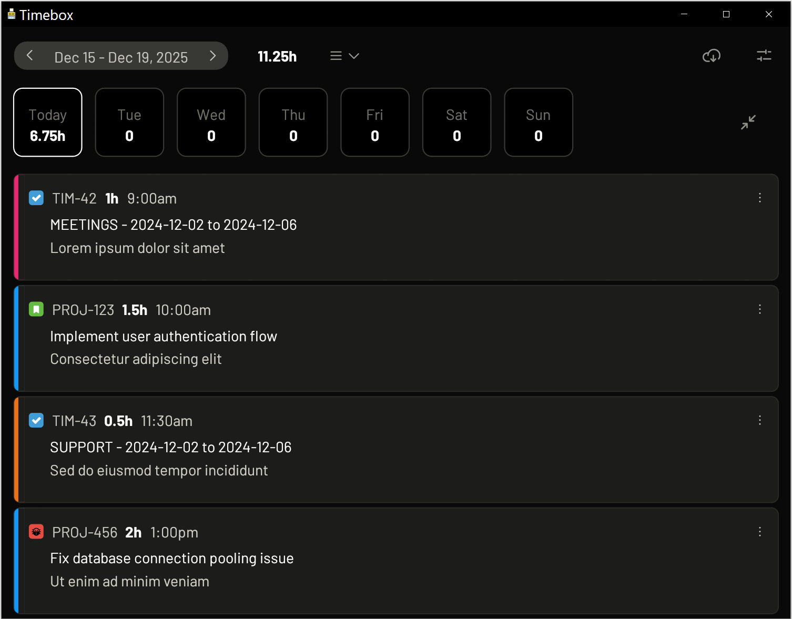
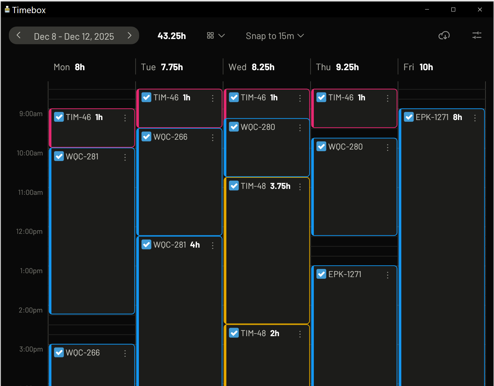

# Timebox: Jira time tracker

A native desktop application for quickly logging time to Jira issues. Built with Rust and egui for a fast, responsive experience.



## Supported platforms

- Windows (x64)
- macOS (x64 and ARM64/Apple Silicon)
- Linux (x64)

## Features

- **Two view modes**: List view for detailed entries, Schedule view for a weekly timeline
- **Zoom with Ctrl+Mousewheel**: Scale the UI from 75% to 200% for comfortable viewing
- View your week's time entries at a glance with day-by-day tabs
- Quick-add buttons for common time buckets (Meetings, Support, Admin)
- Log time to any Jira issue with search/autocomplete
- Issue type icons: Visual indicators for bugs, stories, epics, and tasks
- Category tags for descriptions (e.g., [FE], [BE], [Bugfix]) - fully customizable
- Edit and delete existing work logs (double-click or right-click)
- Flexible time format display (hours/minutes or decimal)
- 12-hour or 24-hour clock format
- Offline detection with clear messaging
- Dark theme optimized for focus
- Weekends automatically shown when you have entries or it's a weekend day

## Installation

### Pre-built releases

Download the latest release for your platform from the [Releases](../../releases) page.

#### macOS: Removing quarantine

macOS may block the downloaded binary. To allow it to run:

```bash
xattr -d com.apple.quarantine ~/Downloads/timebox-aarch64-apple-darwin
chmod +x ~/Downloads/timebox-aarch64-apple-darwin
```

Adjust the path if you downloaded to a different location.

### Building from source

#### Prerequisites

1. Install [Rust](https://rustup.rs/) (1.70 or later recommended)

2. Platform-specific dependencies:

   **Linux (Ubuntu/Debian):**
   ```bash
   sudo apt install libxcb-render0-dev libxcb-shape0-dev libxcb-xfixes0-dev \
                    libspeechd-dev libxkbcommon-dev libssl-dev pkg-config
   ```

   **macOS:** No additional dependencies required (Xcode command line tools recommended)

   **Windows:** No additional dependencies required

#### Build

```bash
# Clone the repository
git clone https://github.com/tzankich/timebox.git
cd timebox

# Build release version
cargo build --release

# The executable will be at:
# Windows: target/release/timebox.exe
# macOS/Linux: target/release/timebox
```

## Configuration

### Creating a Jira API token

1. Log in to [Atlassian Account](https://id.atlassian.com/manage-profile/security/api-tokens)
2. Click **Create API token**
3. Give it a descriptive label (e.g., "Timebox")
4. Copy the token - you won't be able to see it again

### Setting up the application

On first launch, the app will prompt you to enter:
- Jira domain (e.g., `your-company.atlassian.net`)
- Email address
- API token

Credentials are stored locally in a configuration file.

## Usage

### View modes

Toggle between List and Schedule views using the icons in the header.

#### List view

The default view shows the current week with tabs for each day (Mon-Fri, with weekends shown when applicable). Each tab displays:
- The day name (or "Today" for the current day)
- Total time logged for that day

Click a day tab to view and manage entries for that day. Entries are shown as cards with:
- Issue type icon (colored: blue for tasks, green for stories, red for bugs, purple for epics)
- Issue key (clickable link to Jira)
- Duration (bold white)
- Description

**Card modes**: Toggle between contracted (single-line) and expanded (full description) views using the expand/collapse button next to the day tabs.

#### Schedule view



The schedule view displays all days of the week as columns in a timeline grid. Time entries appear as blocks you can interact with:

- **Add entries**: Double-click on empty space to create a new entry at that time
- **Edit entries**: Double-click a block or use the context menu
- **Context menu**: Right-click or click the dots icon on any entry to open in Jira, edit, or delete

The timeline automatically expands to show entries outside the default 5am-8pm range. Quarter-hour grid lines help with visual alignment.

### Logging time

1. Click **Log time** or the **[+]** button to open the time entry dialog
2. Enter the issue key (e.g., `PROJ-123`) or search by typing
3. Enter duration: `1h 30m`, `1.5h`, `90` (minutes), etc.
4. Select category tags (optional) - these appear as prefixes like `[FE][Bugfix]`
5. Add a description of what you worked on
6. Optionally specify a start time (e.g., `9am`, `14:30`) if enabled in settings
7. Click **Save**

### Quick-add buttons

The Meeting, Support, and Admin buttons allow fast time entry to weekly bucket tickets. These search for tickets containing the category name and the current week's dates in the summary.

### Editing entries

- **Double-click** any entry card or schedule block to edit
- **Right-click** for a context menu with Edit, Delete, and Open in Jira options
- Click the **three-dot menu** on any entry for the same options

When editing, you can modify the duration, category tags, start time, and description.

### Zooming the interface

Use **Ctrl+Mousewheel** (or **Cmd+Mousewheel** on macOS) to zoom the entire interface from 75% to 200%. This makes it easy to find a comfortable size for your display and vision. The zoom level is saved automatically.

### Settings

Access settings via the gear icon to change:
- Jira credentials (domain, email, API token)
- Font scale (75% to 200%) - also adjustable via Ctrl+Mousewheel
- Time format (hours/minutes or decimal)
- Clock format (12-hour or 24-hour)
- Start time field visibility
- Category tags (customize the available tag options)

## Time format examples

The duration field accepts flexible input:

| Input | Interpreted As |
|-------|----------------|
| `1h 30m` | 1 hour 30 minutes |
| `1h30m` | 1 hour 30 minutes |
| `1.5h` | 1 hour 30 minutes |
| `90m` | 1 hour 30 minutes |
| `4` | 4 hours (1-8 = hours) |
| `90` | 90 minutes (9+ = minutes) |
| `1.5` | 1.5 hours |

## Troubleshooting

### "API token not configured"
Open Settings and enter your Jira domain, email, and API token.

### "API request failed: 401"
Your API token may be invalid or expired. Generate a new token from your Atlassian account.

### "API request failed: 403"
You may not have permission to log time to the specified issue. Check your Jira permissions.

### App won't start on Linux
Ensure you have the required dependencies installed (see Build section).
